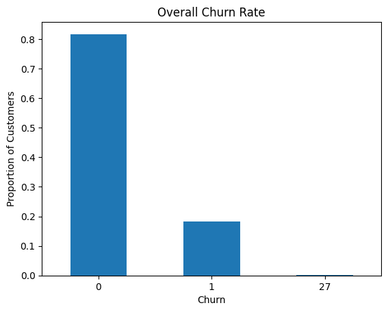
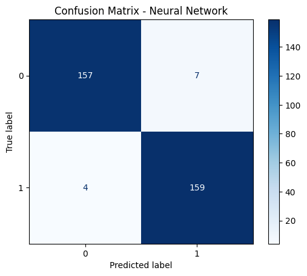
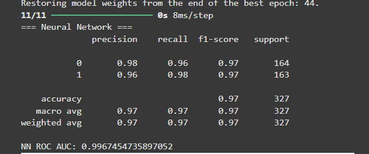
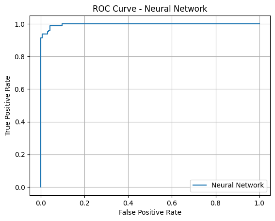
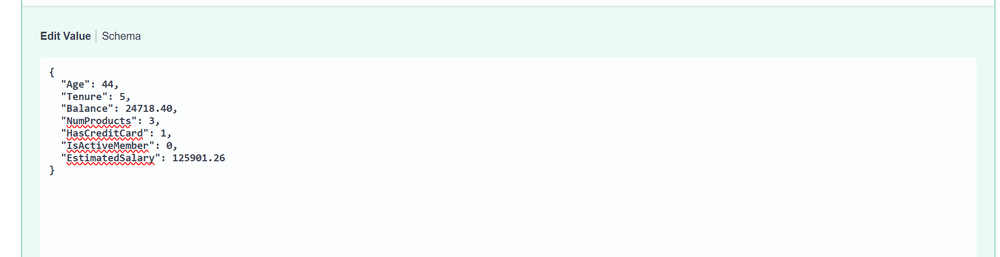

# Bank Churn Prediction Project

## Project Overview

This project develops a predictive model to identify customers at risk of churning from a bank, using a synthetic dataset. The objective is to equip the bank with the ability to take proactive measures to retain high-value customers. The solution includes exploratory data analysis, model experimentation, resampling for class imbalance, and API deployment using FastAPI.

> **Data Source:** Synthetic customer churn dataset  
> **Use Case:** Binary classification — Predict whether a customer will churn (`Churn = 1`) or stay (`Churn = 0`)

### Relevant Links:
1. 
2. 
3. 
4. [Link to Slides](https://docs.google.com/presentation/d/1p7KIACpBcSEeY7Rt1q1tIcmRTx3SxFShUmQHep22BcI/edit?usp=sharing)

---

## Dataset Description

The dataset contains the following fields:

| Feature          | Description                                 |
|------------------|---------------------------------------------|
| CustomerID       | Unique identifier for each customer         |
| Age              | Customer's age                              |
| Tenure           | Years with the bank                         |
| Balance          | Account balance                             |
| NumProducts      | Number of bank products used                |
| HasCreditCard    | Whether the customer has a credit card      |
| IsActiveMember   | Whether the customer is actively engaged    |
| EstimatedSalary  | Estimated annual salary                     |
| Churn            | Target variable (1 = churned, 0 = retained) |

---

## Folder Structure

```
BANK_CHURN_PREDICTION/
│
├── models/                   # Saved models and scaler files
│   ├── bank_churn_nn_model.keras
│   ├── balanced_churn_nn.keras
│   └── bank_churn_scaler.pkl
│
├── notebook/                 # Main Jupyter notebook used for EDA and training
│   └── bank_churn2.ipynb
│
├── screenshots/              # Screenshot outputs for evaluation
│   └── [evaluation metrics, model outputs, plots]
│
├── main.py                   # FastAPI deployment script
├── README.md                 # This file
```

---

## Methodology

### 1. Exploratory Data Analysis
- Class imbalance identified: ~18% of customers had churned.
- Strong imbalance between churned vs. non-churned classes (as shown in the plot below).



### 2. Models Evaluated
The following classification models were implemented:

| Model                | Balanced Handling | Performance Summary                          |
|----------------------|-------------------|-----------------------------------------------|
| Logistic Regression  | Class weights     | Good recall but struggled with precision      |
| XGBoost Classifier   | `scale_pos_weight`| Overfitting to training, poor generalization  |
| Neural Network       | Class weights     | Still biased due to insufficient class 1 data |

### 3. Resampling Techniques Tested

#### a. SMOTE (Synthetic Minority Over-sampling Technique)
- Interpolated synthetic examples of churn class before training.
- **Underperformed** due to:
  - Small number of churn cases
  - Mixed feature types (binary + continuous), which SMOTE cannot handle reliably
  - Generated unrealistic values for binary features (e.g., 0.5 for `HasCreditCard`)

#### b. RandomOverSampler (**Final Technique Used**)

- Randomly duplicated churn examples to balance the classes.
- Performed well without distorting the feature space.
- Maintained correct binary values.
- Final model trained on this resampled data achieved high recall and AUC.

---

## Final Model Training

The best-performing model was a **Neural Network trained on Random Oversampled Data**, with the following architecture:

- `Input Layer` with 64 ReLU units
- Dropout of 0.3
- `Hidden Layer` with 32 ReLU units
- Dropout of 0.3
- `Output Layer` with sigmoid activation


>

**ROC AUC (Test):** ~0.99 
**Recall for Churn Class (1):** ~0.98  
**Accuracy:** ~0.97

---

## Deployment

A FastAPI service was implemented to serve real-time predictions.

### Endpoint:
```http
POST /predict
```

### Input (JSON):
```json
{
  "Age": 42,
  "Tenure": 6,
  "Balance": 140000.0,
  "NumProducts": 2,
  "HasCreditCard": 1,
  "IsActiveMember": 1,
  "EstimatedSalary": 65000.0
}
```


### Output:
```json
{
  "churn_probability": 0.7345,
  "churn_prediction": "Yes"
}

```
###  


---

## Key Findings and Inference

- **Imbalance Handling:** SMOTE was ineffective due to the limited minority samples and binary features. RandomOverSampler performed better by preserving valid input distributions.
- **Model Performance:** The neural network consistently outperformed logistic regression and XGBoost once trained on balanced data.
- **Important Features:** Balance, Tenure, and EstimatedSalary showed notable influence in churn prediction.
- **Generalization:** Using dropout and early stopping mitigated overfitting despite small dataset size.

---

## Recommendations

- Collect more real churn cases to improve generalization.
- Integrate model into CRM systems to trigger retention workflows.
- Monitor model drift and retrain quarterly as behavior changes.

---

## License

This project is for academic and demonstration purposes using synthetic data. No personally identifiable or real customer data was used.


## Author
- Isaiah Essien: i.essien@alustudent.com